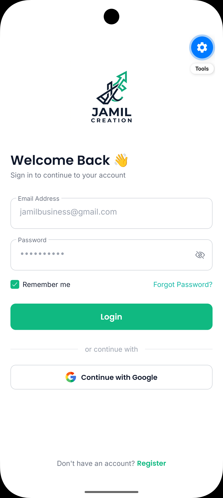
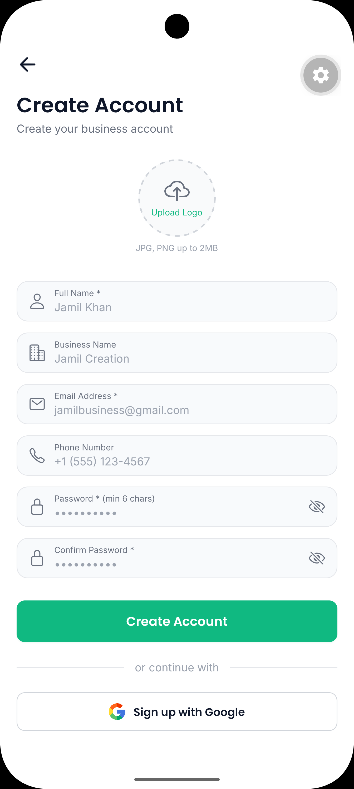
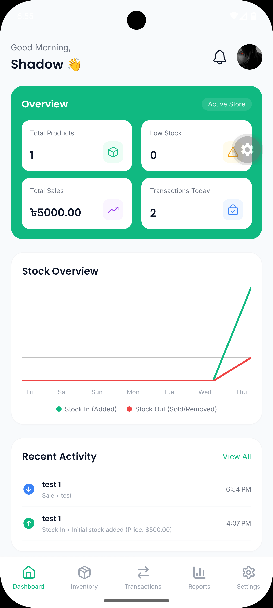
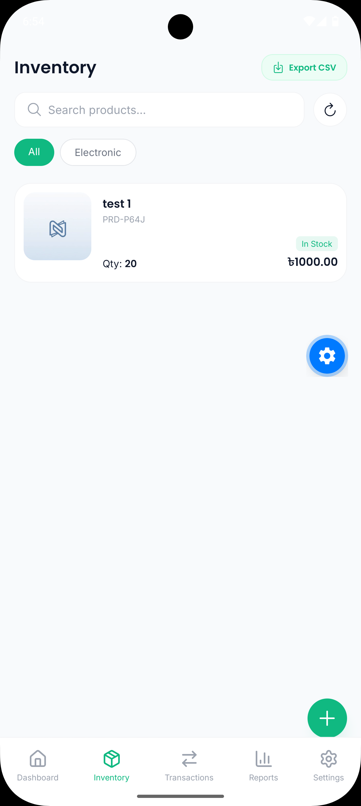
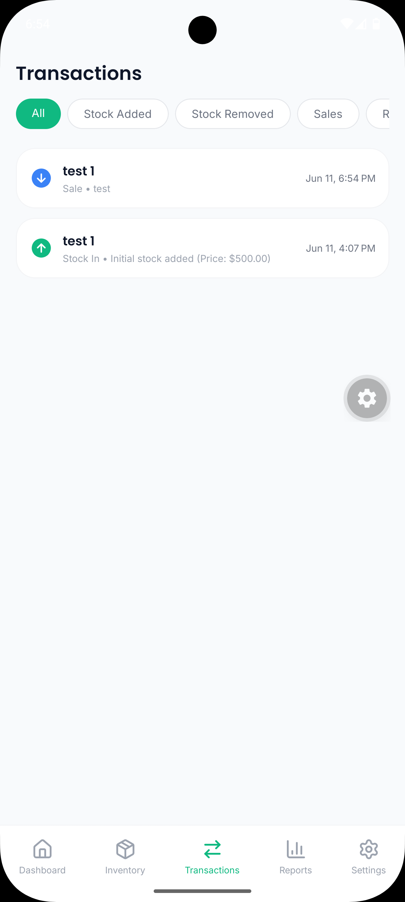
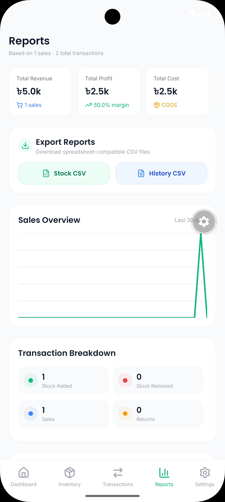
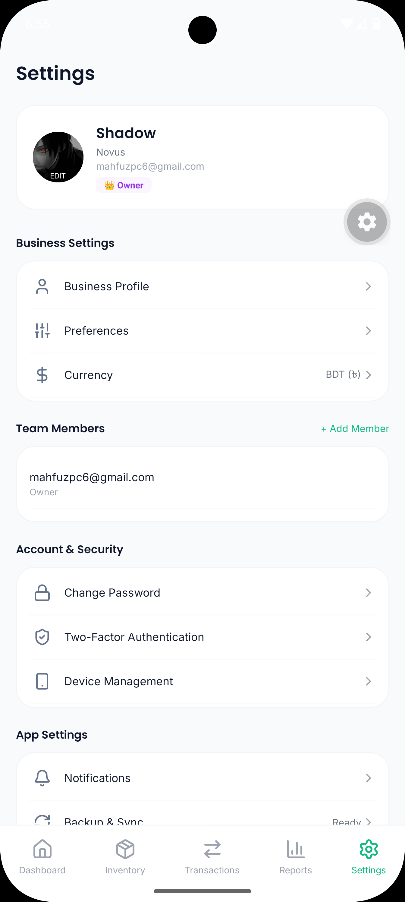

# Jamil Creation — Professional Offline-First Inventory Management

Jamil Creation is a premium, offline-first mobile inventory and sales audit application designed for small-to-medium businesses. Built with **Expo (React Native)**, **WatermelonDB (SQLite)**, and **Supabase (Postgres)**, the app is fully optimized for speed, reliability, security, and real-time collaboration.

---

## 📱 Screenshots

| Login Screen | Signup Screen |
|:---:|:---:|
|  |  |

| Dashboard Overview | Inventory Catalog |
|:---:|:---:|
|  |  |

| Transaction Audit Trail | Report Analytics |
|:---:|:---:|
|  |  |

| Settings & Team Management |
|:---:|
|  |

---

## ✨ Key Features & Architecture

### 🛡️ 1. Multi-Tenant Business Data Isolation
The application enforces strict **data isolation** between separate business profiles:
- **Scope Filtering**: When synchronizing local data with Supabase, the synchronization adapter queries and pushes records filtered strictly by the logged-in user's `business_name`.
- **Database Rules**: Supabase Row-Level Security (RLS) policies prevent users from viewing or modifying records belonging to another business, ensuring complete tenant isolation.
- **Multi-User Collaboration**: Multiple staff members can log into the same business profile to collaborate, with their devices syncing to the same central database.

### 🔄 2. Offline-First Sync Architecture
- **Instant Local Performance**: All reads/writes happen instantly on a local SQLite database using **WatermelonDB**. There are no network loading states or spinner blocks during inventory entry.
- **Two-Way Synchronization**: A custom sync adapter manages conflicts (Last-Write-Wins based on `updated_at` timestamps) to push local modifications and pull remote updates.
- **Auto-Sync Triggers**: Sync runs automatically 1.5 seconds after app startup (allowing the UI to render first) and triggers every time the app is returned to the foreground.

### 📷 3. Native Barcode Scanner (Scan & Sell)
- **Viewfinder Overlay**: Custom scanning modal built using Expo's `CameraView` with a sleek animated green scanning laser, targeting box, and permissions management.
- **Instant Product Search**: Scanning a barcode on the Dashboard or Sell screen automatically looks up the item, pre-populates forms, and updates quantities.
- **Developer Simulator Support**: Built-in simulator fallback form lets developers test scanning matching/missing logic without a physical camera or device.

### 🔔 4. Scoped Real-Time Push Notifications
- **Supabase Database Triggers**: Adding transactions or registering low stock initiates an Edge Function or DB trigger.
- **Business Scope Isolation**: Push tokens are linked to users and their `business_name`. Notifications are dispatched *only* to active users sharing the *same* business profile.
- **Background Support**: Supports Expo Notifications with deep-linking to route users to the appropriate Screen when they tap an alert.

### 🔐 5. Two-Factor Authentication (2FA / MFA)
- **TOTP Standards**: Native integration of Time-based One-time Passwords compatible with Google Authenticator and Authy.
- **QR Code Generation**: Displays setup QR codes natively within the app (using SVG components) along with secure verification controls.
- **Session Refreshes**: Integrates secure local token refreshes with Supabase auth.

### 📦 6. Inventory Management
- Add, edit, and view products with images, SKU, barcode, category, pricing, and supplier info
- Low-stock alerts based on configurable thresholds
- Product detail modal with full info view
- Beautiful empty states when no products exist or no filters match

### 💰 7. Sales & Transactions
- **Record Sale screen** — pick a product, enter quantity, see revenue/profit summary live before confirming
- Stock automatically decremented when a sale is recorded
- Full transaction log with filters (Stock Added / Stock Removed / Sales / Returns)

### 📊 8. Reports & Analytics
- **Dynamic Reports screen** powered by live WatermelonDB data
- Total Revenue, Profit, and Cost stats (real-time)
- 30-day sales overview line chart
- Top-selling products pie chart
- Transaction breakdown by type

### 🏠 9. Dashboard
- Overview card with live stats: Total Products, Low Stock count, Total Sales, Transactions Today
- Recent activity feed
- Quick actions: Add Product, Sell, Scan Barcode

### ⚙️ 10. Settings & Profile
- Profile picture upload to Supabase Storage (`avatars` bucket)
- User display name, business name, email shown
- 2FA enrollment section
- **Sign Out** with confirmation dialog

---

## 🛠️ Tech Stack

| Component | Technology | Description |
|---|---|---|
| **Frontend Framework** | [Expo](https://expo.dev) / React Native | Modern cross-platform framework |
| **Navigation** | [Expo Router](https://expo.github.io/router/) | Clean, file-based routing |
| **Local Database** | [WatermelonDB](https://nozbe.github.io/WatermelonDB/) | SQLite wrapper for fast, reactive queries |
| **Cloud Database** | [Supabase](https://supabase.com) | Postgres database, Auth, Storage bucket |
| **Sync** | WatermelonDB `synchronize` + custom pull/push adapters | Two-way offline-first replication |
| **State Management** | `withObservables` + `Zustand` | Reactive components & cart logic |
| **Styling** | [NativeWind](https://www.nativewind.dev/) | Tailwind CSS for fast responsive UI |
| **Charts** | [victory-native](https://commerce.nearform.com/open-source/victory-native/) | Interactive line and pie charts |
| **Icons** | `@expo/vector-icons` (Ionicons) + `lucide-react-native` | Premium iconography |
| **Unit Testing** | [Jest](https://jestjs.io/) / `ts-jest` | Comprehensive math & store tests |
| **CI/CD** | [GitHub Actions](https://github.com/features/actions) | Automated test validation pipelines |

---

## 🗄 Database Schema

### `products`
| Column | Type | Notes |
|---|---|---|
| `id` | `text` PK | WatermelonDB UUID |
| `name` | `text` | Required |
| `sku` | `text` | Required |
| `barcode` | `text` | Optional |
| `category` | `text` | Required |
| `quantity` | `integer` | Current stock |
| `buying_price` | `numeric(10,2)` | Cost price |
| `selling_price` | `numeric(10,2)` | Sale price |
| `supplier` | `text` | Optional |
| `warehouse` | `text` | Optional |
| `location` | `text` | Optional |
| `image_url` | `text` | Optional |
| `low_stock_threshold` | `integer` | Default: 5 |
| `business_name` | `text` | Business scope key |
| `created_at` / `updated_at` | `timestamptz` | Auto-managed |

### `transactions`
| Column | Type | Notes |
|---|---|---|
| `id` | `text` PK | WatermelonDB UUID |
| `product_id` | `text` FK | References `products(id)` |
| `product_name` | `text` | Snapshot at time of tx |
| `type` | `text` | `added` \| `removed` \| `sold` \| `returned` |
| `quantity` | `integer` | Units involved |
| `note` | `text` | Optional |
| `by_user` | `text` | User email or name |
| `business_name` | `text` | Business scope key |
| `created_at` / `updated_at` | `timestamptz` | Auto-managed |

### `push_tokens`
| Column | Type | Notes |
|---|---|---|
| `user_id` | `uuid` PK | References `auth.users(id)` |
| `token` | `text` | Expo push token |
| `business_name` | `text` | Scoped notification routing |
| `updated_at` | `timestamptz` | Auto-managed |

---

## 🚀 Getting Started

### Prerequisites
- Node.js ≥ 18
- Expo CLI + EAS CLI
- Android device or emulator with **Expo Dev Client** installed

### Setup

```bash
# Clone the repo
git clone https://github.com/mihsanalam/JamilCreation.git
cd JamilCreation

# Install dependencies
npm install

# Create environment file
cp .env.example .env
# Add your Supabase URL and anon key to .env
```

### Environment Variables

Create a `.env` file in the project root:

```env
EXPO_PUBLIC_SUPABASE_URL=https://your-project.supabase.co
EXPO_PUBLIC_SUPABASE_ANON_KEY=your-anon-key
```

### Supabase Setup

Run the following SQL in your **Supabase SQL Editor** to set up the database:

```sql
-- Create tables
CREATE TABLE products (
  id text PRIMARY KEY,
  name text NOT NULL,
  sku text NOT NULL,
  barcode text,
  category text NOT NULL,
  quantity integer DEFAULT 0,
  buying_price numeric(10,2) DEFAULT 0.00,
  selling_price numeric(10,2) DEFAULT 0.00,
  supplier text, warehouse text, location text,
  image_url text,
  low_stock_threshold integer DEFAULT 5,
  server_id text,
  business_name text,
  created_at timestamptz DEFAULT now() NOT NULL,
  updated_at timestamptz DEFAULT now() NOT NULL
);

CREATE TABLE transactions (
  id text PRIMARY KEY,
  product_id text NOT NULL REFERENCES products(id) ON DELETE CASCADE,
  product_name text NOT NULL,
  type text NOT NULL,
  quantity integer DEFAULT 0,
  note text,
  by_user text NOT NULL,
  server_id text,
  business_name text,
  created_at timestamptz DEFAULT now() NOT NULL,
  updated_at timestamptz DEFAULT now() NOT NULL
);

CREATE TABLE push_tokens (
  user_id uuid PRIMARY KEY REFERENCES auth.users(id) ON DELETE CASCADE,
  token text NOT NULL,
  business_name text,
  updated_at timestamptz DEFAULT now() NOT NULL
);

CREATE TABLE business_members (
  id uuid DEFAULT gen_random_uuid() PRIMARY KEY,
  business_name text NOT NULL,
  email text NOT NULL,
  role text NOT NULL CHECK (role IN ('owner', 'staff')),
  created_at timestamptz DEFAULT now() NOT NULL,
  UNIQUE (business_name, email)
);

-- Enable RLS
ALTER TABLE business_members ENABLE ROW LEVEL SECURITY;

-- Policies for business_members
CREATE POLICY "Allow read business members" ON business_members
  FOR SELECT TO authenticated USING (true);

CREATE POLICY "Allow insert new business or by owner" ON business_members
  FOR INSERT TO authenticated
  WITH CHECK (
    NOT EXISTS (
      SELECT 1 FROM business_members WHERE business_members.business_name = business_name
    )
    OR EXISTS (
      SELECT 1 FROM business_members
      WHERE business_members.business_name = business_name
        AND business_members.email = auth.jwt()->>'email'
        AND business_members.role = 'owner'
    )
  );

CREATE POLICY "Allow owners to update members" ON business_members
  FOR UPDATE TO authenticated
  USING (
    EXISTS (
      SELECT 1 FROM business_members
      WHERE business_members.business_name = business_name
        AND business_members.email = auth.jwt()->>'email'
        AND business_members.role = 'owner'
    )
  );

CREATE POLICY "Allow owners to delete members" ON business_members
  FOR DELETE TO authenticated
  USING (
    EXISTS (
      SELECT 1 FROM business_members
      WHERE business_members.business_name = business_name
        AND business_members.email = auth.jwt()->>'email'
        AND business_members.role = 'owner'
    )
  );

-- Auto-update timestamps
CREATE EXTENSION IF NOT EXISTS moddatetime SCHEMA extensions;
CREATE TRIGGER handle_updated_at BEFORE UPDATE ON products FOR EACH ROW EXECUTE PROCEDURE moddatetime(updated_at);
CREATE TRIGGER handle_updated_at BEFORE UPDATE ON transactions FOR EACH ROW EXECUTE PROCEDURE moddatetime(updated_at);

-- Enable RLS
ALTER TABLE products ENABLE ROW LEVEL SECURITY;
ALTER TABLE transactions ENABLE ROW LEVEL SECURITY;
ALTER TABLE push_tokens ENABLE ROW LEVEL SECURITY;

-- Policies (authenticated users only)
-- We check if the user's email belongs to the business in the secure business_members table.
-- This prevents users from altering their client-side user_metadata to access other businesses.

CREATE POLICY "Allow products operations by business membership" ON products
  FOR ALL TO authenticated
  USING (
    EXISTS (
      SELECT 1 FROM business_members
      WHERE business_members.business_name = products.business_name
        AND business_members.email = auth.jwt()->>'email'
    )
  )
  WITH CHECK (
    EXISTS (
      SELECT 1 FROM business_members
      WHERE business_members.business_name = products.business_name
        AND business_members.email = auth.jwt()->>'email'
    )
  );

CREATE POLICY "Allow transactions operations by business membership" ON transactions
  FOR ALL TO authenticated
  USING (
    EXISTS (
      SELECT 1 FROM business_members
      WHERE business_members.business_name = transactions.business_name
        AND business_members.email = auth.jwt()->>'email'
    )
  )
  WITH CHECK (
    EXISTS (
      SELECT 1 FROM business_members
      WHERE business_members.business_name = transactions.business_name
        AND business_members.email = auth.jwt()->>'email'
    )
  );

CREATE POLICY "Users manage own token" ON push_tokens FOR ALL TO authenticated USING (auth.uid() = user_id) WITH CHECK (auth.uid() = user_id);

```

Also create an **`avatars`** Storage bucket in Supabase Dashboard (Storage → New Bucket → name: `avatars`, Public: ✅).

### Run the App

```bash
npx expo start --dev-client
```

---

## 📁 Project Structure

```
src/
├── app/
│   ├── _layout.tsx          # Root layout, auth guard, splash, sync trigger
│   ├── (auth)/
│   │   ├── login.tsx        # Email/password login
│   │   └── register.tsx     # Registration screen
│   ├── (tabs)/
│   │   ├── index.tsx        # Dashboard (Home)
│   │   ├── inventory.tsx    # Product list with empty states
│   │   ├── transactions.tsx # Transaction log with filters
│   │   ├── reports.tsx      # Analytics & charts
│   │   └── settings.tsx     # Profile, security, logout
│   └── product/
│       ├── add.tsx          # Add / Edit product
│       └── sell.tsx         # Record Sale screen
├── components/
│   ├── BottomNav.tsx        # Tab bar navigation
│   ├── BarcodeScannerModal.tsx  # Camera scanner with viewfinder overlay
│   ├── ui/
│   │   └── Skeleton.tsx     # Skeleton loading animations
│   └── inventory/
│       └── ProductDetailsModal.tsx
├── db/
│   ├── index.ts             # WatermelonDB instance
│   ├── schema.ts            # Table schema definitions
│   ├── migrations.ts        # Schema version migrations
│   ├── sync.ts              # Two-way Supabase sync engine
│   └── models/
│       ├── Product.ts
│       └── Transaction.ts
├── hooks/
│   ├── useAuth.ts           # Supabase auth state hook
│   └── useRole.ts           # Role-based access control hook
├── services/
│   ├── supabase.ts          # Supabase client (with JWT persistence)
│   └── notifications.ts     # Push & local notification services
├── store/
│   └── inventoryStore.ts    # Zustand cart & search state
├── utils/
│   └── inventory.ts         # Pure calculation helpers (profit, revenue, stock checks)
├── __tests__/
│   ├── utils/inventory.test.ts      # 23 utility assertions
│   └── store/inventoryStore.test.ts # 11 store assertions
└── types/
    └── index.ts
```

---

## 🔄 Offline Sync Architecture

```
Device (WatermelonDB SQLite)
        ↕  sync()
Supabase (PostgreSQL)
```

- **Pull**: Fetches all records updated since `lastPulledAt` from Supabase, filtered by `business_name`
- **Push**: Sends created/updated/deleted local records to Supabase with `business_name` injection
- **Conflict resolution**: Last-write-wins via `updated_at` timestamps
- **Trigger**: On app start + every foreground resume

---

## 🔐 Security

- **RLS enabled** — only authenticated JWT holders can access data
- **Business isolation** — sync engine and push notifications are scoped by `business_name`
- **Token auto-refresh** — Supabase client refreshes tokens automatically
- **Session persistence** — stored securely in `AsyncStorage`
- **2FA support** — TOTP via standard authenticator apps (Google Authenticator / Authy)
- **No `any` types** — Entire codebase is strictly typed with TypeScript (0 compiler errors)

---

## 🗺 Roadmap

- [x] Barcode scanner integration (Scan & Sell)
- [x] Push notifications for low-stock alerts
- [x] Multi-user role permissions (Owner / Staff)
- [x] CSV export for reports (Inventory & Transactions)
- [x] Image compression before upload
- [x] Loading skeletons on all screens
- [x] Unit test suites with Jest (34 tests passing)
- [x] Multi-tenant business data isolation
- [x] GitHub Actions CI/CD pipeline
- [x] Professional empty states for all screens

---

## 🧪 Testing & CI/CD

The codebase includes a comprehensive test suite built with **Jest** and **ts-jest** to verify inventory calculations and state management.

### Running the Tests

To run the unit tests, execute the following command in the project root:

```bash
npm test
```

### Test Coverage

The test suite covers:
- **Inventory Utilities (`src/utils/inventory.ts`)**: 23 assertions verifying profit, revenue, cost calculations, low stock checks, over stock conditions, and date-based transaction filters.
- **Zustand Cart & Search Store (`src/store/inventoryStore.ts`)**: 11 assertions verifying cart operations (adding, updating quantities, duplicate item accumulation, clearing), cart profit/revenue totals, and state-based inventory category/search filters.

### 🤖 CI/CD Pipeline

We have configured a **GitHub Actions CI Pipeline** (under `.github/workflows/node.js.yml`) to automate code quality checks:
- **Triggers**: Executed automatically on every `push` or `pull_request` to `main` or `master` branches.
- **Node Versions**: Evaluates and runs builds across Node `18.x` and `20.x` containers.
- **Verification**: Automatically runs the Jest unit test suite. Passing tests are required before code merges.

---

## 📄 License

MIT — see [LICENSE](./LICENSE)
